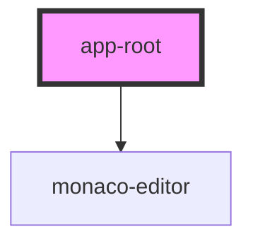

# app-root

<!-- Auto Generated Below -->

## Properties

| Property   | Attribute  | Description | Type                                                                      | Default                                                                                                                                           |
| ---------- | ---------- | ----------- | ------------------------------------------------------------------------- | ------------------------------------------------------------------------------------------------------------------------------------------------- |
| `code`     | `code`     |             | `string`                                                                  | ``
   <h1 style={{ background: 'red' }}>test playground</h1>   <button>test button</button> 
``                                          |
| `model`    | --         |             | `{ filename: string; content: string; language: string; options?: any; }` | `{     filename: 'index.html',     language: 'html',     content: this.code,     options: {       lineNumbers: 'on',       theme: 'vs'     }   }` |
| `readonly` | `readonly` |             | `boolean`                                                                 | `undefined`                                                                                                                                       |
| `theme`    | `theme`    |             | `string`                                                                  | `undefined`                                                                                                                                       |

## Dependencies

### Depends on

- monaco-editor

### Graph

----------------------------------------------

*Built with [StencilJS](https://stenciljs.com/)*
